 

### `$ cat contributions.log`

 

### `$ whoami --verbose`

<table>
  <tr>
    <td valign="top"></td>
    <td valign="top"></td>
  </tr>
</table>

 

---

### `$ ls ./tech-stack`

 

#### Languages

#### AI / ML

#### Tools

 

---

### `$ ls ./projects`

| Project | Description | Stack |
| ------- | ----------- | ----- |
| [**windows-developer-mcp**](https://github.com/peeyushcodes/windows-developer-mcp) | Production-grade MCP server for Windows with 40+ sandboxed dev tools | `Python` `MCP` |
| [**taipan**](https://github.com/peeyushcodes/taipan) | AI-native programming language with VM and C transpilation | `Python` |
| [**resume-builder**](https://github.com/peeyushcodes/resume-builder) | ATS-compliant resume engine generating .docx/.pdf from JSON schemas | `JavaScript` `Node.js` |
| [**Youtube-Agent**](https://github.com/peeyushcodes/Youtube-Agent) | AI agent for YouTube automation | `Python` |

 

---

### `$ ping --status`

 

 

  <code>graph.svg</code> auto-refreshes daily via GitHub Actions ·
  Built with pure Python + SMIL SVG animations · No external badge services

